# [✈️ OMG (Oh My Guide)](https://youtu.be/vrL-VPoE8to)

- omg 접속 : [OMG Link](http://43.202.189.185:8080/)
<br/>

## 프로젝트 개요
> 사용자가 **여행을 계획**하고 **동행자를 모집**하며, **여행 후기를 공유**할 수 있는 종합 여행 지원 플랫폼입니다.
- **Convention**: 📑[Coding Convention](https://github.com/oh-my-guide/OMG_project/wiki/Coding-Convention)
- **그라운드 룰** 📑[Team Rule](https://github.com/oh-my-guide/OMG_project/wiki/Team-Rule)

<br/>

## 🧑‍🤝‍🧑 팀원 소개

|                          [전현진](https://github.com/HyeonJinJeon)                          |                           [곽유진](https://github.com/jinijavac)                            |                                                   [손설빈](https://github.com/seolbb)                                                    |                                          [김혜주](https://github.com/kimoju01)                                          |                                          [박경서](https://github.com/kyongseo)                                           |
|:----------------------------------------------------------------------------------------:|:----------------------------------------------------------------------------------------:|:-------------------------------------------------------------------------------------------------------------------------------------:|:--------------------------------------------------------------------------------------------------------------------:|:---------------------------------------------------------------------------------------------------------------------:|
|  |  |  |  |                                | 
|           `채팅`<br/>그룹채팅, 이미지 업로드<br/> `알림`<br/>댓글, 대댓글, 채팅 알림<br/>`서버 배포 및 관리`           |          `CRUD`<br/>여행일정, 일정 가져오기, <br/>그룹 생성<br/> `명소추천 API` <br/>`서버 배포 및 관리`          |                         `CRUD`<br/>일행모집, 여행후기, 조회수, <br/>찜, 좋아요, 댓글/대댓글, 비밀글, <br/>카테고리 별 검색 및 정렬<br/>`서버 배포 및 관리`                         |                      `지도API`<br/>카카오맵 API, 마커 표시<br/>`이미지`<br/>회원, 게시글 이미지 업로드<br/>`서버 배포 및 관리`                      | `유저 및 인증-인가`<br/> 로그인, 회원가입, OAuth2, 마이페이지<br/>`관리자 페이지`<br/>회원, 게시글 관리, 공지사항 CRUD<br/>`날씨 API`<br/>`서버 배포 및 관리` | 


## 🚀 기술 스택

OS | Stack
--- | --- |
Language |      
IDE |  
Framework |   
Build Tool |  
Database |  
Library |        
API |     
DevOps |      
Tools |        
Messaging | 

<details>
<summary><strong>🎊기술 & 라이브러리 사용 이유</strong></summary>
<div markdown="1">   
  <br/>


  <details>
  <summary><strong> RDS - MySQL</strong></summary>
    <div markdown="1">     

    1. 프로젝트 전 MySQL을 미리 학습한 경험이 있어 다른 DB보다 빠르게 프로젝트에 적용이 가능하기 때문에 선택했습니다
    2. 현업에서 MySQL의 점유율 높기 때문에 레퍼런스를 찾기 쉬웠습니다.


  </details>

  <details>
  <summary><strong> Redis</strong></summary>
    <div markdown="1">

    1. AWS 아키텍처로 구성된 프로젝트에서 최적화된 서비스와 팀 프로젝트 환경에서 효과적인 모니터링을 위해서 AWS 클라우드 제품을 사용했습니다.
    2. 다양한 데이터 타입과 영속화가 필요했습니다.
    3. 자동으로 만료되는 데이터를 다룰 수 있어 캐시 시스템으로 이상적입니다. 이를 통해 데이터의 유효성을 관리하고 불필요한 메모리 사용을 줄일 수 있었습니다.

  </details> 

  <details>
  <summary><strong> APACHE - KAFKA</strong></summary>
    <div markdown="1">     

    1. 초당 수백막 건의 데이터를 처리할 수 있어 실시간 데이터 처리에 적합합니다.
    2. Pub/Sub기반으로 느슨한 처리가 가능해 확장성과 유연성이 뛰어납니다
    3. 메시지를 저장해 데이터 손실 방지 기능을 제공합니다

  </details> 


  <details>
  <summary><strong> Git Action</strong></summary>
    <div markdown="1">     

    1. 다양한 플러그인을 제공하여 빌드, 테스트, 배포, 모니터링 등 다양한 작업을 지원합니다
    2. 높은 유연성과 확장성을 제공하여 특정 요구에 맞게 파이프라인을 구성하고 자동화할 수 있습니다.
    3. 빌드 상태에 대한 알림 기능을 제공하며, 이벤트에 대한 알림을 설정하여 정보를 실시간으로 전달합니다.

  </details> 


</div>
</details>
</br>


## 📁 배포 CI/CD 아키텍처
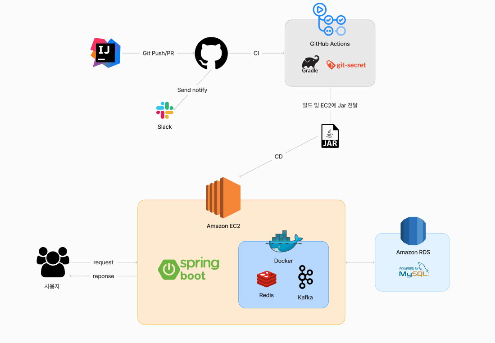


---
<details>
<summary><strong>🛠 주요 기능</strong></summary>

#### 🔥 유저 
- OAuth 로그인: Google, Kakao, Naver를 이용한 소셜 로그인 지원 
- 일반 회원가입: 이메일 인증 후 JWT를 통한 인증/인가 처리 
- 로그인 방식에 따라 다른 사용자 정보 표시
- 비밀번호 재설정, 비밀번호 찾기

#### 🔥 여행 일정
- 일정 관리: 일정 생성, 수정, 삭제 가능 
- 여행 정보 입력: 제목, 여행지
- 위치 검색: 경도, 위도, 이름 기반으로 일정 추가
- 날짜별 마커 표시
- 위치 기반으로 명소 추천

#### 🔥 일행 모집
- 여행 동행자 모집 기능 
- 타 사용자는 모집 중인 플랜에 참가 요청 가능

#### 🔥 일정 후기
- 일정 후기 기능
- 타 사용자는 일정이 마음에 든 경우 찜 및 가져오기 가능

#### 🔥 마이 페이지
- 프로필 및 개인정보 확인: 사용자의 정보 관리 및 수정
- 일정 관리: 참여/생성한 일정, 찜 목록, 게시글 작성 목록
- 회원탈퇴 기능 지원
- 이미지 업로드

#### 🔥 알림
- 서버 이벤트 기반 자동 알림 발행 
- 사용자 초대 알림 
- 일정 관련 알림: 댓글, 대댓글, 채팅 알림

#### 🔥 채팅 기능
- 개인/그룹 채팅 지원

</details>


## 🌉 화면 구성

<div align="center">

### 🏷️ Main
|                                **메인 페이지**                                |
|:------------------------------------------------------------------------:|
| 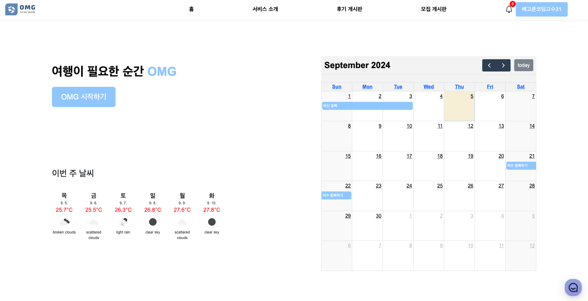 |


### 🏷️ 유저 관리
|                                 **회원 가입**                                 |                                  **로그인**                                  |
|:-------------------------------------------------------------------------:|:-------------------------------------------------------------------------:|
| 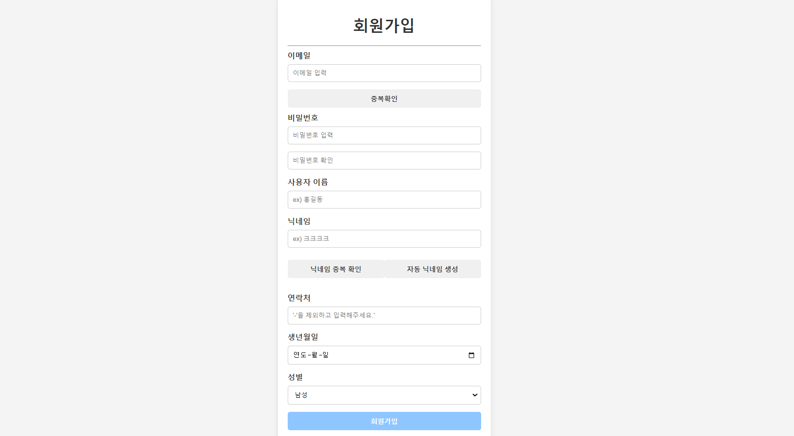 | 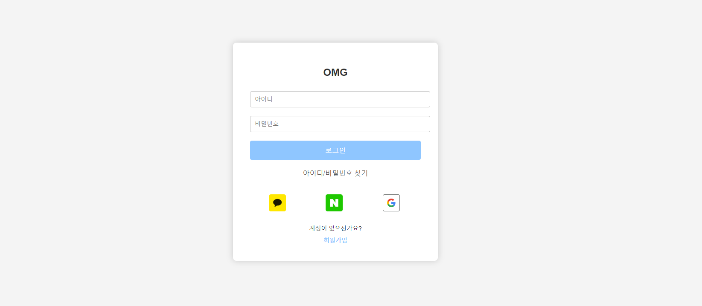 |

|                              **회원가입 인증 이메일**                              |                              **비밀번호 찾기 이메일**                              |
|:-------------------------------------------------------------------------:|:-------------------------------------------------------------------------:|
| 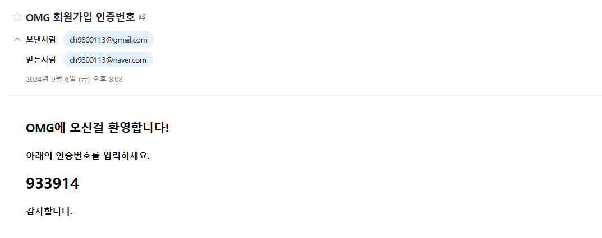 | 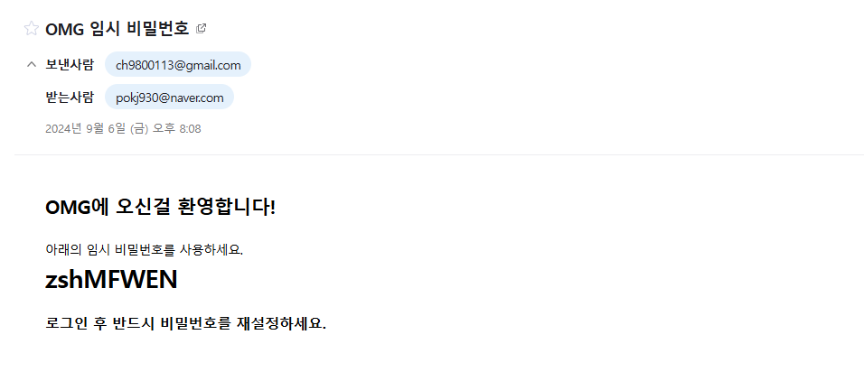 |

|                                **비밀번호 찾기**                             |                               **비밀번호 재설정**                                |
|:-------------------------------------------------------------------------:|:-------------------------------------------------------------------------:|
| 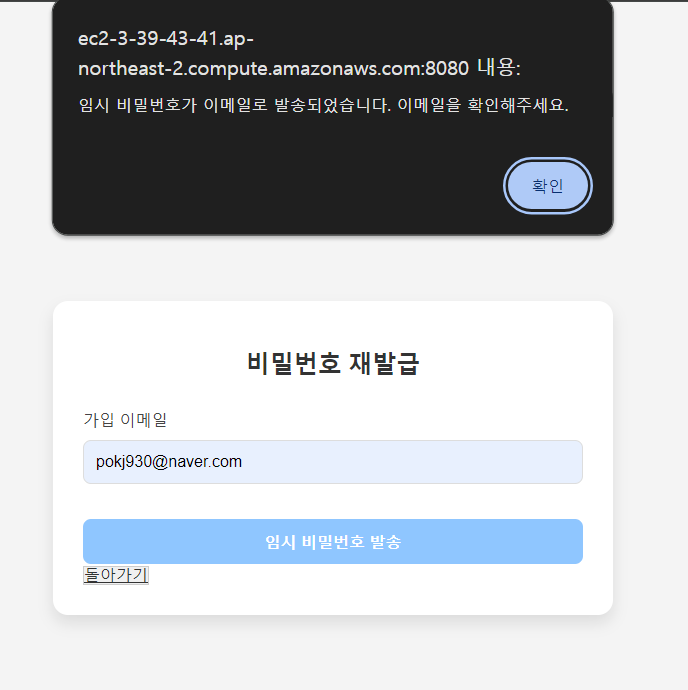 | 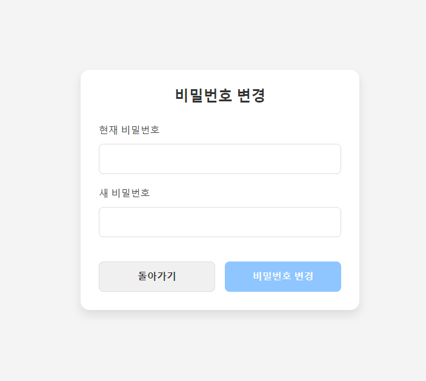 |

### 🏷️ 여행계획 짜기
|                               **시도, 구군 검색**                               |                                 **마커 표시**                                 |
|:-------------------------------------------------------------------------:|:-------------------------------------------------------------------------:|
| 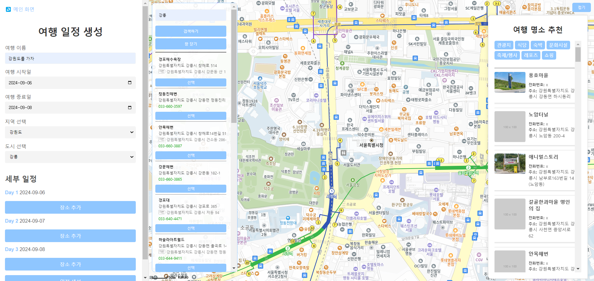 | 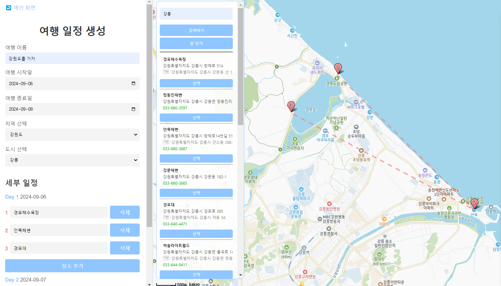 |

### 🏷️ 여행정보 공유
|                               **일행 모집 게시글**                           |                               **여행 후기 게시글**                               |
|:-------------------------------------------------------------------------:|:-------------------------------------------------------------------------:|
| 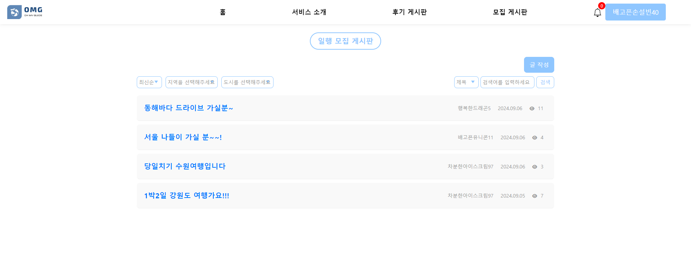 | 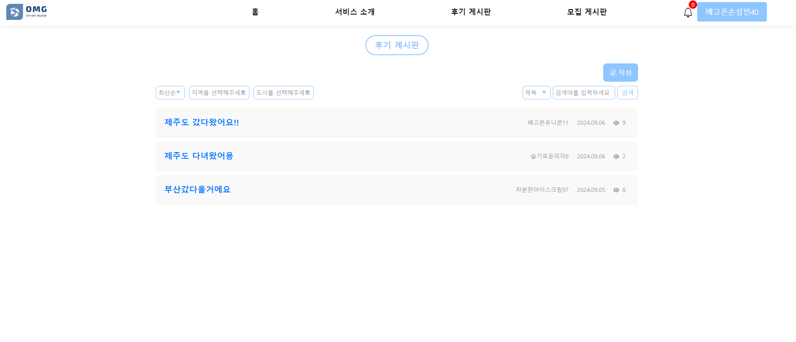 |

### 🏷️ 내 프로필

|                                 **나의 여행 관리**                           |                                **프로필 수정**                                 |
|:-------------------------------------------------------------------------:|:-------------------------------------------------------------------------:|
|  |  |

### 🏷️ 채팅 및 알림

|                                   **채팅**                                    |                                   **알림**                                   |
|:-------------------------------------------------------------------------:|:-------------------------------------------------------------------------:|
| 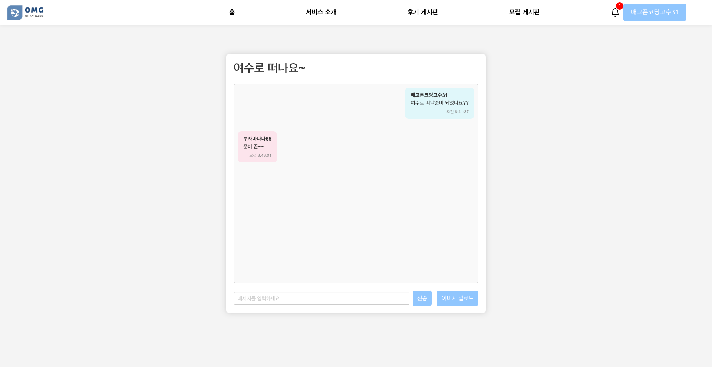 |  |

### 🏷️ 관리자 페이지
|                                **사용자 목록**                                 |                                  **게시글 목록**                                   |                                    **공지사항**                                     |
|:-------------------------------------------------------------------------:|:-------------------------------------------------------------------------:|:---------------------------------------------------------------------------:|
|  | 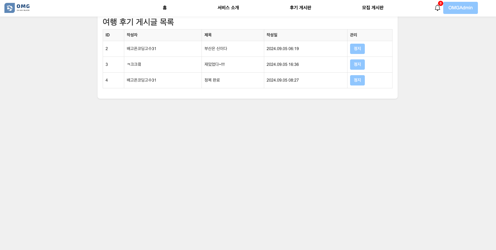 | 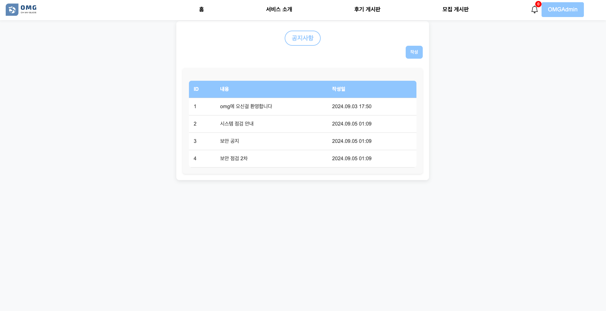   |


</div>

---

## ⌨️ 설치 및 실행 방법

<details>
<summary><strong>설치 및 실행 방법</strong></summary>

### 필수 설치 도구

- **Java 21 버전**: [Java 다운로드 링크](https://www.oracle.com/java/technologies/javase-jdk21-downloads.html)
- **Docker**: [Docker 설치 가이드](https://docs.docker.com/get-docker/)

### 실행 단계

1. **필수 도구 설치**: 위의 링크를 통해 Java 21 버전 및 Docker를 설치합니다.

2. **`docker-compose.yml` 파일 작성**: 프로젝트 디렉토리에 `docker` 폴더를 생성하고, 각 서비스에 맞는 하위 폴더와 `docker-compose.yml` 파일을 작성합니다.

    - **Kafka 폴더 및 `docker-compose.yml` 파일**

      `docker/kafka/docker-compose.yml` 파일 내용:

      ```yaml
      services:
        zookeeper:
          image: bitnami/zookeeper:latest
          ports:
            - "2181:2181"
          environment:
            - ALLOW_ANONYMOUS_LOGIN=yes
 
        kafka:
          image: bitnami/kafka:latest
          ports:
            - "9092:9092"
          environment:
            - KAFKA_CFG_ZOOKEEPER_CONNECT=zookeeper:2181
            - ALLOW_PLAINTEXT_LISTENER=yes
            - KAFKA_CFG_LISTENERS=PLAINTEXT://:9092
            - KAFKA_CFG_ADVERTISED_LISTENERS=PLAINTEXT://localhost:9092
          depends_on:
            - zookeeper
      ```

    - **Redis 폴더 및 `docker-compose.yml` 파일**

      `docker/redis/docker-compose.yml` 파일 내용:

      ```yaml
      services:
        redis:
          image: redis:latest
          container_name: redis
          command: ["redis-server", "--requirepass", "1234"]
          ports:
            - "6379:6379"
          volumes:
            - ./redis-data:/data
      volumes:
        redis-data:
      ```

    - **MySQL 폴더 및 `docker-compose.yml` 파일**

      `docker/mysql/docker-compose.yml` 파일 내용:

      ```yaml
      services:
        vacation-db:
          image: mysql
          restart: always
          environment:
            MYSQL_ROOT_PASSWORD: "1234"
            MYSQL_DATABASE: "example"
            MYSQL_USER: "your_username"
            MYSQL_PASSWORD: "your_password"
          command:
            - "--character-set-server=utf8mb4"
            - "--collation-server=utf8mb4_unicode_ci"
          volumes:
            - "./database/init:/docker-entrypoint-initdb.d/"
            - "./database/datadir:/var/lib/mysql"
          platform: linux/x86_64
          ports:
            - "3306:3306"
      ```

3. **Docker 컨테이너 실행**: 터미널에서 각 서비스의 폴더로 이동하여 Docker Compose 명령어를 실행합니다.

   ```bash
   # Kafka 서비스 실행
   cd docker/kafka
   docker-compose up -d

   # Redis 서비스 실행
   cd ../redis
   docker-compose up -d

   # MySQL 서비스 실행
   cd ../mysql
   docker-compose up -d

4. **데이터베이스에 데이터 추가**: local에서 처음으로 프로젝트를 진행하려고 할 때 city와 role에 관한 초기 데이터를 추가합니다.
    ```sql
    INSERT INTO cities (name) VALUES ('서울'), ('부산'), ('대구'), ('인천'), ('광주'), ('대전'), ('울산'), ('세종'), ('춘천'), ('원주'), ('강릉'), ('동해'), ('태백'), ('속초'), ('삼척'), ('홍천'), ('횡성'), ('평창'), ('정선'), ('영월'), ('수원'), ('고양'), ('용인'), ('성남'), ('부천'), ('남양주'), ('안산'), ('안양'), ('평택'), ('의정부'), ('군포'), ('오산'), ('시흥'), ('하남'), ('의왕'), ('양주'), ('파주'), ('광명'), ('구리'), ('여주'), ('창원'), ('김해'), ('진주'), ('양산'), ('거제'), ('통영'), ('사천'), ('밀양'), ('함안'), ('거창'), ('창녕'), ('산청'), ('의령'), ('고성'), ('하동'), ('합천'), ('포항'), ('경주'), ('구미'), ('김천'), ('안동'), ('영주'), ('상주'), ('문경'), ('경산'), ('영천'), ('청송'), ('영양'), ('봉화'), ('울릉'), ('예천'), ('성주'), ('군위'), ('의성'), ('천안'), ('아산'), ('서산'), ('공주'), ('보령'), ('논산'), ('계룡'), ('당진'), ('홍성'), ('예산'), ('서천'), ('청양'), ('부여'), ('금산'), ('청주'), ('충주'), ('제천'), ('단양'), ('음성'), ('진천'), ('괴산'), ('보은'), ('옥천'), ('영동'), ('여수'), ('순천'), ('목포'), ('나주'), ('광양'), ('담양'), ('곡성'), ('구례'), ('고흥'), ('보성'), ('장흥'), ('강진'), ('해남'), ('완도'), ('진도'), ('신안'), ('무안'), ('영암'), ('전주'), ('군산'), ('익산'), ('남원'), ('정읍'), ('김제'), ('완주'), ('진안'), ('무주'), ('장수'), ('고창'), ('임실'), ('순창'), ('제주'), ('서귀포');
    ```
    ```sql
   INSERT INTO roles (id, name) VALUES (1, 'ROLE_ADMIN');
    INSERT INTO roles (id, name) VALUES (2, 'ROLE_USER');
    ```
---
</details>

